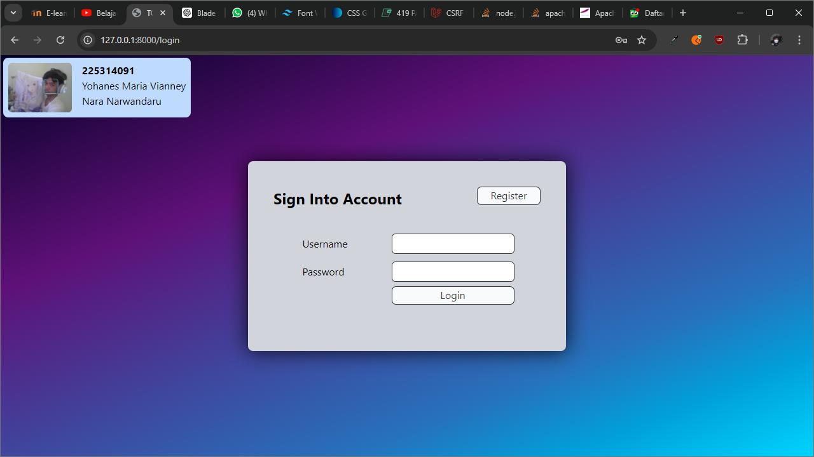
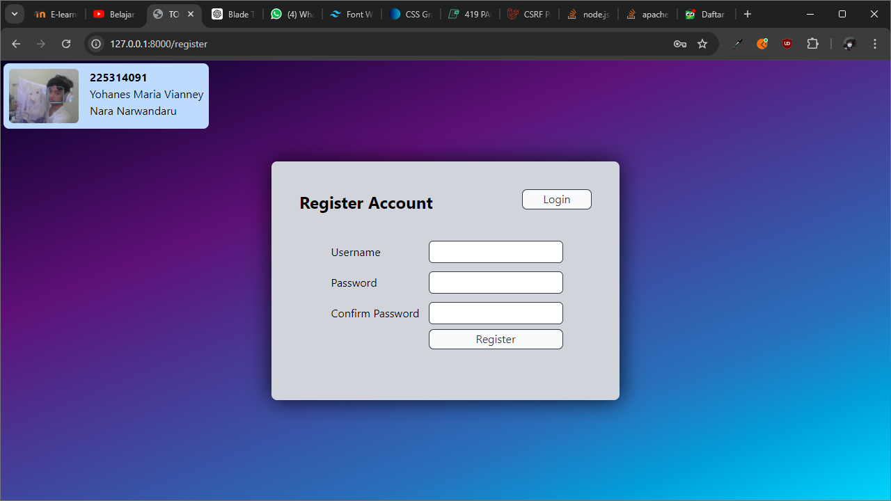
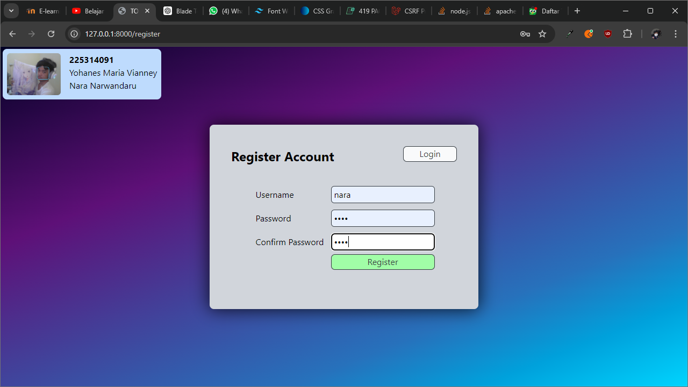
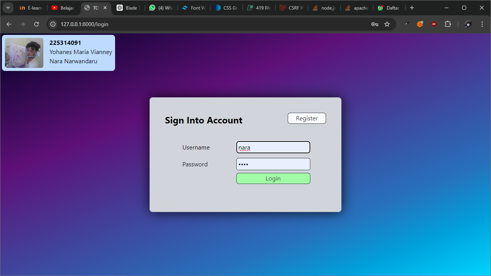
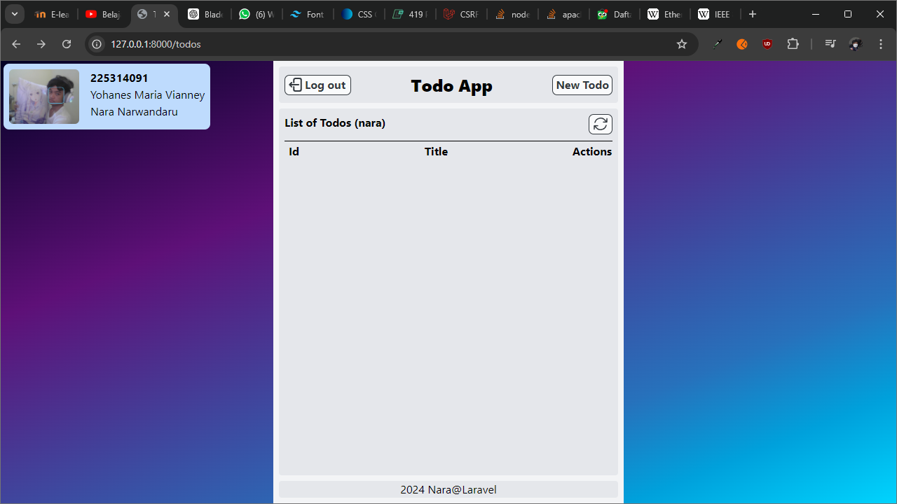
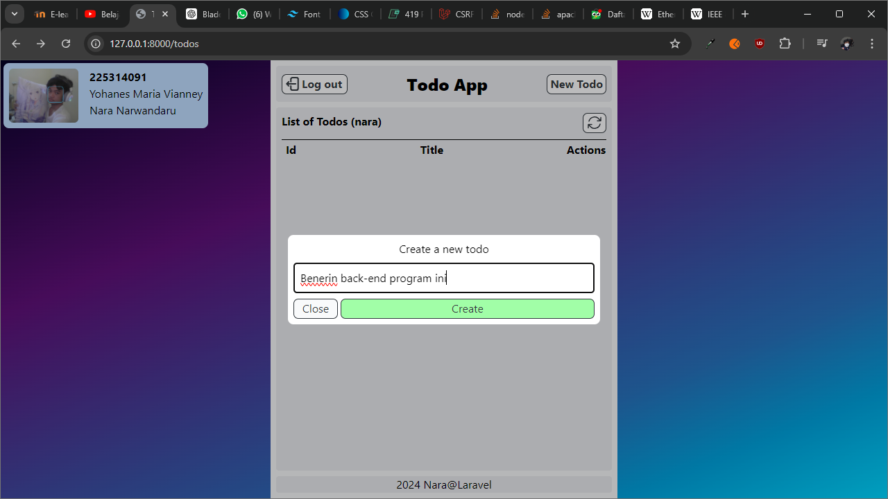
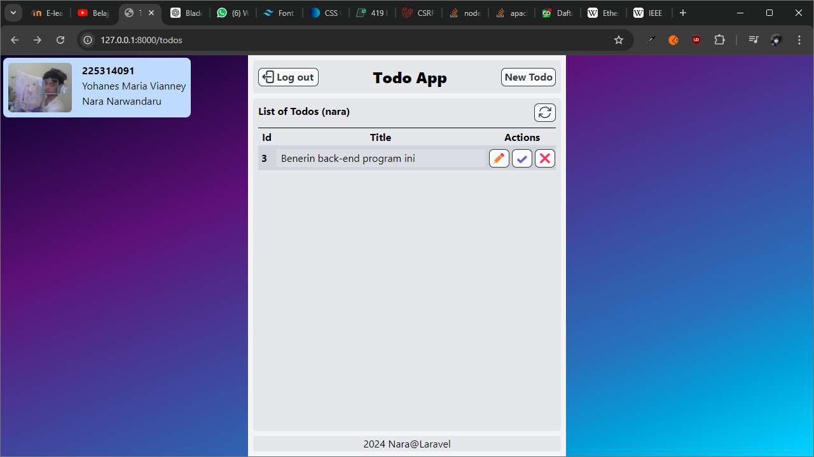
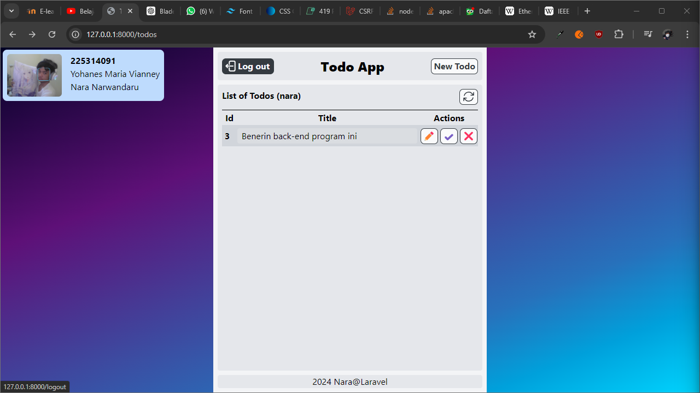

# Laravel ToDo App

This project is used to practice REST API with Laravel.
Although the project is simple, it is a good example to understand the basics of REST API.
We'll be progressing gradually and adding more features to the project.
The system will be monolithic at the moment, utilizing RESTFUL standards.

The current project will utilize Laravel, PostgreSQL, and Postman.

## Process Documentation

### Initializing laravel project

1. Creating Laravel project using composer
```bash
composer create-project laravel/laravel todo-app-laravel
```

2. Creating `todolist` user and database in PostgreSQL
```sql
CREATE USER todolist WITH PASSWORD 'todolist';

CREATE DATABASE todolist OWNER todolist;

GRANT ALL PRIVILEGES ON DATABASE todolist TO todolist;
-- or
ALTER DATABASE todolist OWNER TO todolist;
```

## Preview (Alur Program)

1. Login
   
2. Register
   
3. Registering
   
4. Logging in
   
5. Redirected to TODO page
   
6. Creating new TODO
   
7. New TODO created
   
8. Toggling TODO status
   
   
9. Deleting a TODO:
   
   
10. Logout (to login page)
    
11. Logged as another user
    
